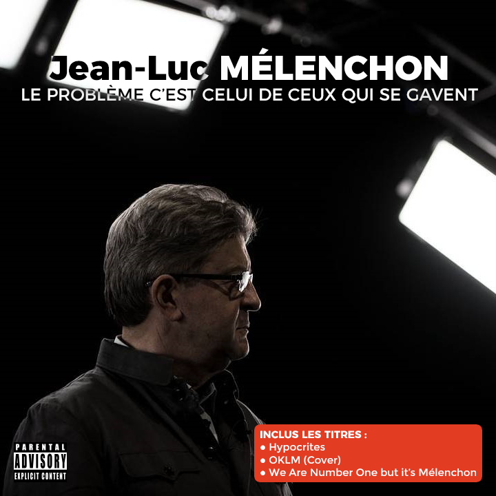

Le Grand Débat de TF1 ? Un départ en douceur... Tout en douc.... Oulah ! Décidément, Fillon, fidèle à lui même, a une apathie contagieuse. Dans ses pensées, le représentant de la droite française n'entend pas son assistante qui l'houspille et lui demande d'entrer en scène. À raison, elle se situait à sa gauche et de plus, ces derniers jours, ce vrai geek ne lit plus que ses sms.

Heureusement, MC Mélenchon va vite s'imposer comme le King de ce débat. Notre plus récent sondage, 340 000 votants, considère que Jean Luc devrait, à 74%, s'offrir le luxe de produire un album de rap en parallèle à sa campagne politique. Il est vrai que "Vos pudeurs de gazelles" ou "il faut bien qu'il y ait un débat au PS" sont des punchlines qui vont rester dans les Annales des débats politiques et faire d'excellents titres d'un EP tant attendu.

[{width=540}](melenchon-ep.png)

Benoît Hamon un peu en retrait, il a fallu qu'il se frotte à l'étalon Macron pour lui redonner du poil de la bête. Et oui apparemment, la question du financement de la campagne du candidat d'En Marche lui provoque de l'urticaire. Toutefois ce n'est pas ce débat qui aura permis au candidat du PS de se démarquer. "Not my tempo" a-t-il crié à son cœur (qu'il tente vaillamment de faire battre) le lendemain. Et les sondages le confirment (en douteriez-vous ?). Vote utile ? 82% de nos 624 000 votants se disent favorables désormais au désistement d'Hamon en faveur de Mélenchon.

<blockquote class="twitter-tweet" data-lang="fr">
Vu que les sondages étaient le seul argument de <a href="https://twitter.com/hashtag/Hamon?src=hash">#Hamon</a> pour que <a href="https://twitter.com/hashtag/M%C3%A9lenchon?src=hash">#Mélenchon</a> se désiste, est-ce qu&#39;il doit lui même retirer sa candidature ?
&mdash; OPIF (@InstitutOPIF) <a href="https://twitter.com/InstitutOPIF/status/844887671906451460">23 mars 2017</a></blockquote>

Quant à Marine Le Pen ? Rien. Ou presque. Elle est tout aussi obnubilée par le mustang Emmanuel Macron. Elle est tellement convaincue de le rencontrer au deuxième tour qu'elle s'est même accordée avec Jean-Luc Mélenchon à la fin du débat sur la question des handicapés. Franchement, rien ne lui résiste au beau Jean-Luc. Grand Corps Insoumis. Swag.

<iframe width="560" height="315" src="https://www.youtube.com/embed/cm1AQk30kFs" frameborder="0" allowfullscreen></iframe>
