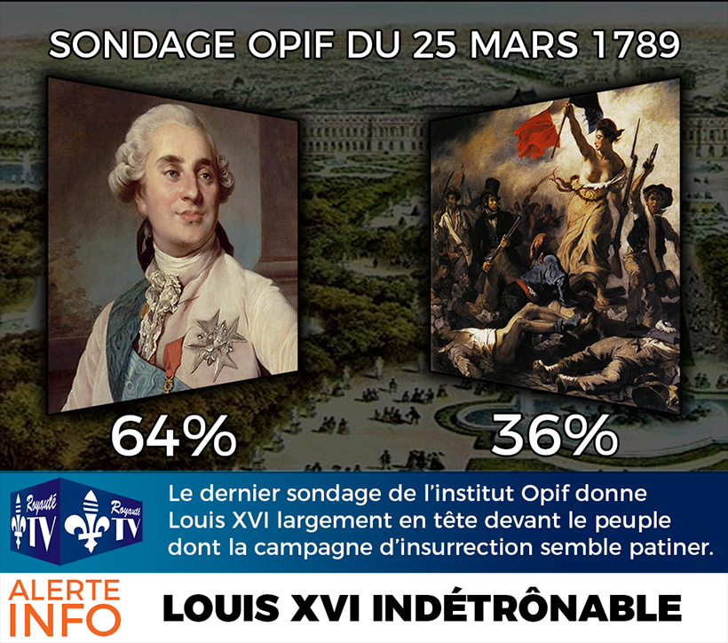

Aujourd'hui, nous vous proposons un petit retour en arrière en ressortant de nos archives un des sondages qui a fait le plus polémique en cette année tumultueuse de 1789. Ce sondage, effectué auprès de 345 personnes essentiellement résidant à Versailles - Château (pour des raisons évidentes de facilité de communication avec nos équipes autrefois implantées au 98 Boulevard de la Reine, Versailles, Royaume de France) a été réalisé avec la méthode des quotas. La marge d'erreur n'était alors pas encore requise pour la publication de sondages.

La chaîne de télévision Royauté TV (regrettablement remplacée par BFMacron TV bien plus tard sur le même canal) publiait donc en avant première le résultat de notre sondage qui donnait l'avantage à 64 % pour le Roi Louis XVI (né Louis-Auguste de France) contre 36 % pour le bas-peuple avec ses enfants armés jusqu'au cou et ses femmes dénudées.

Il est bien entendu facile maintenant de douter de ce résultat avec le regard que l'on peut avoir après-coup mais on peut tout de même observer la capacité de nos sondages à détecter surtout les tendances.

Nous vous proposerons comme ça régulièrement un petit retour en arrière dans nos archives pour vous montrer les avancées dans le domaine de la sondocratie au cours des siècles.
