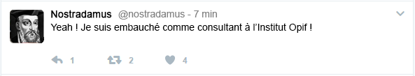

Nous avons le plaisir de vous informer du recrutement au poste de consultant de notre honorable confrère le Docteur Nostradamus, PhD, expert sondagier.

Nous espérons que cette nouvelle vous réjouira autant que nous tous au dernier étage.

Le Dr Nostradamus apporte avec lui plus de 40 ans d'expérience dans le domaine et sera à n'en pas douter un atout majeur pour nos équipes, surtout en cette période électorale. N'hésitez pas à le féliciter quand vous le verrez passer dans les bureaux ♥

Pour mémoire, le Dr Nostradamus avait notamment parfaitement analysé les dynamiques de la campagne présidentielle de 2016 aux Etats-Unis, prédisant ainsi l'élection de M. Trump.

> Centurie 3, quatrain 81 : 
>Le grand criard sans honte audacieux, 
>Sera esleu gouverneur de l'armée: 
>La hardiesse de son contenteur 
>Le pont rompu, cité de pur pasmée. 
>(Trump devient Commandant en Chef des Armées)
>
>Dr Nostradamus, Les Propheties, 4 mai 1555 {.author}
