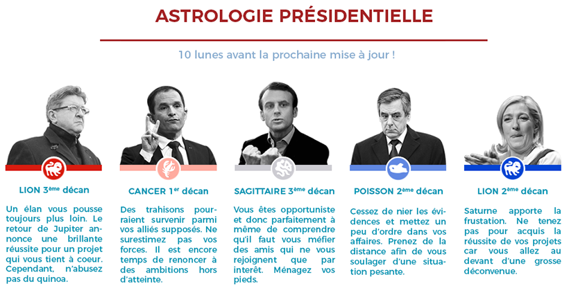

Nous avons interrogé un échantillon représentatif d'astres pour savoir ce qu'ils pronostiquaient pour le premier tour de la présidentielle.
Cet horoscope sondagier a été effectué en appliquant la méthode des quotas.

Il semblerait que monsieur Jean-Luc Mélenchon ait eu raison de se [féliciter hier à son meeting de Châteauroux d'horoscopes favorables](http://www.lepoint.fr/politique/melenchon-se-felicite-d-horoscopes-favorables-et-assure-qu-il-saura-gouverner-02-04-2017-2116665_20.php).

Voyez vous-même.

