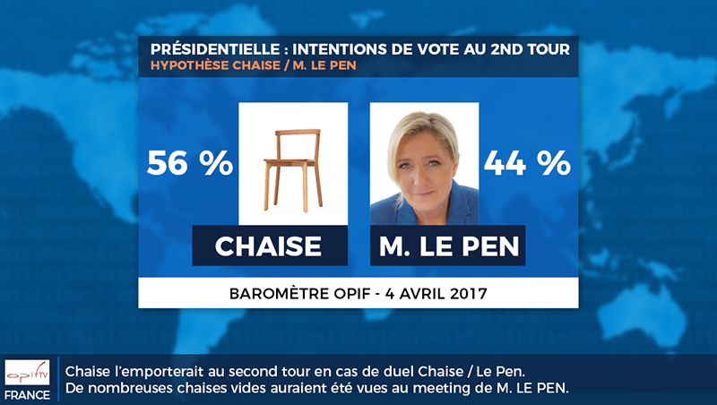

Dimanche dernier, M. Jean-Luc Mélenchon déclarait lors de son meeting à Châteauroux : "Une chaise sera élue plutôt que Marine Le Pen".

Interpelé par cette déclaration, notre institut a sondé un échantillon représentatif de français pour savoir ce qu'ils en pensent.
La réponse est sans appel.

Nous avons par ailleurs effectué un sondage en ligne auprès de notre panel de 552 tweetos (méthode des ricottas) et celui-ci indique également qu'une chaise serait très largement élue face à Marine Le Pen, avec 89% des intentions de vote contre seulement 11% pour la candidate "fille de".  Cette analyse d'opinion confirmerait-elle l'arnaque du vote utile dès le premier tour ?

<blockquote class="twitter-tweet" data-lang="fr">
Sondage pour le second tour des élections présidentielles
&mdash; OPIF (@InstitutOPIF) <a href="https://twitter.com/InstitutOPIF/status/849232401368797185">4 avril 2017</a></blockquote>

