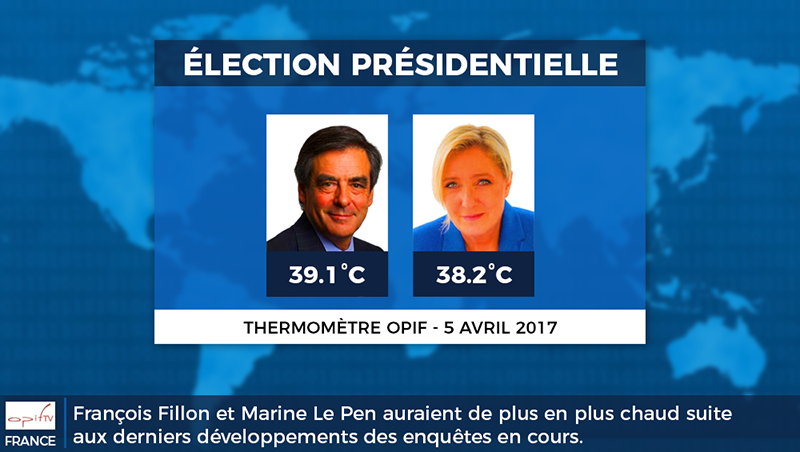

À l'Opif nous sommes bien placés pour savoir que durant une campagne électorale tous les paramètres comptent.

Aujourd'hui nous nous intéressons donc à la température de deux candidats à la présidentielle. Et force est de l'admettre ... ils sont chauds !

