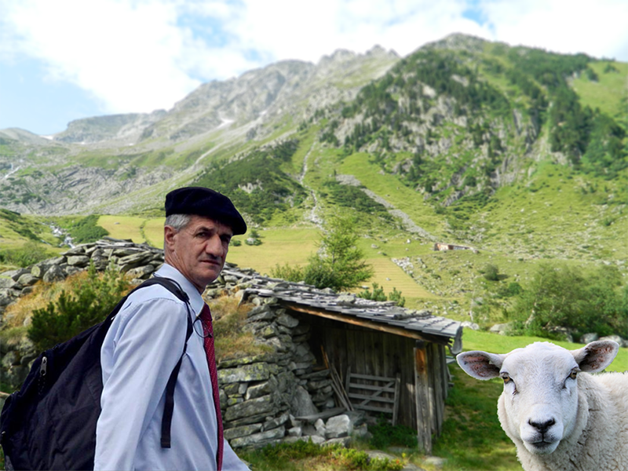

Pour ses abonnés, l’institut Opif revient sur l’événement sondagier qui a frappé les esprits ce mardi soir lors du débat BFM TV / CNews.
Le journal Slate a déjà fait [un article à ce sujet](http://www.slate.fr/story/142790/sondages-ligne-debat){target=_blank} mais nous souhaitions de notre côté approfondir l'analyse de la mobilisation surprise en faveur de l'underdog du débat.

Mardi, après plus d’une heure d’interventions de 45 secondes, les premiers résultats du sondage en ligne RTL tombent et donnent bien évidemment le jeune Macron et son armée de bots au coude à coude avec le patron du Youtube game (ndlr : Jean-Luc Mélenchon et ses 250k abonnés). Mais alors que le sondage est sur le point de donner naturellement le candidat d’internet victorieux, un phénomène d’une rare intensité va se produire.

<iframe height="700" src="http://jmbernard.com/images/laec/rtl/" width="100%"></iframe>

Simulation reconstituant le [sondage RTL](http://www.rtl.fr/actu/politique/le-grand-debat-quel-candidat-vous-convainc-le-plus-7787954093) du 4 avril 2017.{.legend}

Jean Lassalle, le candidat du peuple de la montagne va se retrouver sur le plateau victime d’un dédain sans précédent de la part de Ruth Elkrief, BFM queen dite « la sans pitié ». Cet évènement d’une rare brutalité couplé aux mauvaises ondes provoquées par l’utilisation massive des robots en marche va déclencher un contrefeux inattendu en faveur du candidat des Pyrénées. Agacés par tant de mépris et de malhonnêteté, les ovins vont se résoudre à intervenir dans le débat.

Alors que les équipes du candidat Hamon (dit le Copy Ninja) venaient tout juste de finir de copier les techniques de l’empereur des bots en marche et pouvaient espérer monter sur le podium, les moutons des montagnes vont faire faire un bond spectaculaire à Jean Lassalle en le faisant passer à 27% ! Incroyable ! Et leur appétit semble inextinguible ! Voilà qu'ils partent à la conquête de la première place du podium ! 29% puis 31% ils sont maintenant plus de 400 000 à s’être donnés le mot et voilà que Jean Lassalle passe devant JLM se fendant d’un Can’t Lassallon ! Il est 23h, RTL ne peut plus contenir l’affluence des moutons qui sont maintenant 700 000 et positionnent Jean Lassalle en première position avec 35% ! Les stagiaires non payés de la rédaction d’Opif sont en pleine euphorie, ils n’ont jamais rien vu de tel !

Imperturbable, le directeur de l’institut Opif décrypte pour nous ce processus mystérieux :
« C’est un phénomène particulièrement exceptionnel. En effet, lorsqu’ils repèrent une trop grande présence d’Astroturf (ndlr : L’Astroturfing est la création d’opinion factice via l’utilisation des bots, en opposition à l’option dite Grass-Root : enracinée, organique, réelle) les moutons se connectent massivement au réseau et se mobilisent pour porter secours à Jean Lassalle, leur candidat naturel, le plaçant sans difficulté en tête de n’importe quel sondage non sécurisé. »

Corroborant cette analyse, notre envoyé spécial en direct de l’ambassade de l’Equateur à Londres nous confirme :
« Mountain sheep have the ability to browse every opinion that is not grassrooted. They particulary love synthétic grass (i.e : Astroturf) and are very keen on helping people who are in desperate situation. This is what happened with Jean Lassalle. It’s one of the best case study we have ever seen in France. »

Il semble bien que les sondages en ligne pour cette élection présidentielle n’aient pas fini de nous surprendre. La rédaction d’Opif reste sur le qui vive pour apporter un décryptage de « qualité top+ » à ses abonnés.
