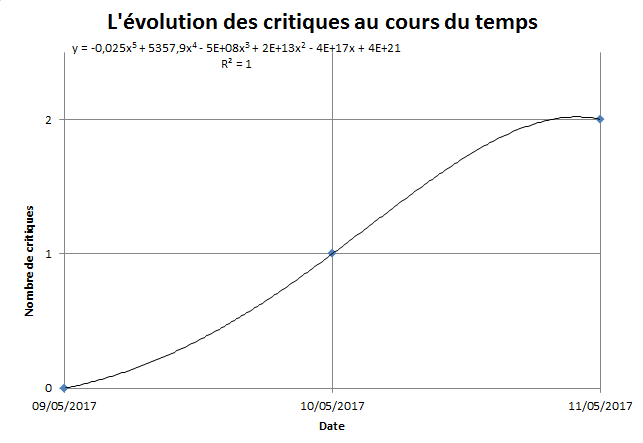

Suite à la vague de critiques citées par Le Monde, nous nous permettons d'apporter notre pierre à l'édifice : les critiques se multiplient-elles réellement à l'endroit de Jean-Luc Mélenchon ?

Observons les faits rapportés par cet article :

- Le 9 mai, Jean-Luc Mélenchon n'avait pas encore fait part de son souhait de présenter sa candidature dans la 4ème circonscription des Bouches-du-Rhône : les critiques étaient donc inexistantes à cet instant précis. Il s'agira donc de notre point de référence.
- Le 10 mai, après avoir annoncé ce souhait à l'antenne de RMC devant Jean-Jacques Bourdin, une première critique apparaît : celle de Patrick Mennucci, député socialiste des Bouches-du-Rhône.
- Le 11 mai, Luc Carvounas, sénateur socialiste, vient à son tour d'émettre une critique selon nos confrères du Monde.
Nous avons donc compilé toutes ces données pour déterminer si oui ou non, les critiques se "multiplient".

À partir d'une analyse brute, on constate que, **à priori**, le nombre de critiques est effectivement croissant. Nul ne saurait dire si Jean-Luc Mélenchon va parvenir à enrayer cette inexorable progression d'ici aux élections législatives.

Cependant, chez l'Institut OPIF, on aime bien pousser à fond nos analyses de data et faire parler les chiffres. Nous avons donc utilisé une toute autre méthode d'analyse, et le résultat nous a étonné :

Sur cette dernière courbe, laquelle, rappelons-le, utilise strictement les mêmes données d'entrée que la première, on constate au contraire un essoufflement des critiques formulées à l'encontre de Jean-Luc Mélenchon, après une forte progression.
Il est donc tout à fait possible que ces critiques finissent par se tarir quelques jours seulement après l'annonce de l'ex-candidat à la présidentielle.
Concluons donc en revenant sur le titre de nos confrères du Monde, en rappelant simplement que, faute de données en nombre suffisant, il n'est malheureusement pas possible de déclarer avec certitude si les critiques vont, ou non, se poursuivre.

Nous tenons enfin à souligner que cette multiplication apparente des critiques, passant de une à deux en l'espace d'une seule journée, peut également s'apparenter à une somme.
Nous nous penchons actuellement sur cette épineuse question.
