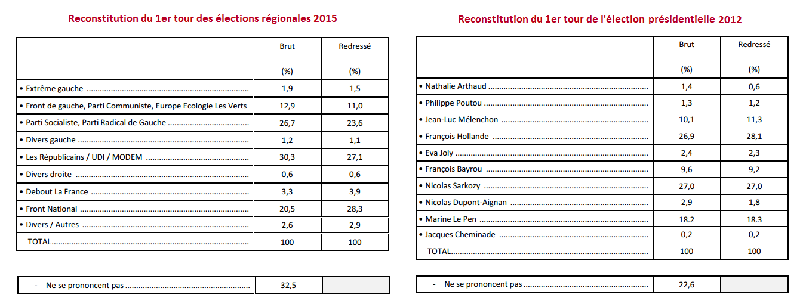

Avant de constituer un institut de sondage agréé comme Opif, nous avons passé plusieurs années à réunir les talents, potassant les ouvrages de référence en statistique, intervalles de confiance en loi du chi² et mondélisation multinomiale des fluctuations de l'électorat n'ayant plus de secrets pour les experts ès-sondage de Opif. 

# Méthodologie : comment fonctionnent les sondages traditionnels ?

   ## Réalisation d'un sondage politique
   
   ### L'échantillonage uniforme
   
   Dans l'idéal, il suffit de sélectionner aléatoirement dans la population française mille personnes avec une probabilité égale, puis de leur demander pour qui elles comptent voter. Cette méthode est difficile à réaliser en pratique, certaines catégories de la population étant beaucoup plus dures à atteindre que d'autres (travailleurs de nuit, personnes agées ou qui ne répondent pas au téléphone) et ces nombreux biais de non-réponse induisent des prévisions fausses.
  
   ### Méthode des quotas
   
   Le sondeur commence alors par recenser dans une base de donnée plusieurs milliers de personnes, puis demande à chacune : son âge, lieu de résidence, profession, vote en 2012. Ensuite, un panel de mille personnes est constitué d'une façon telle que les proportions de jeunes,  retraités, ouvriers, cadres, agriculteurs, électeurs de chacun des candidats de 2012 corresponde approximativement à celles de la population française. Ce panel est dit représentatif ce qui signifie que les proportions d'électeurs de chacun des candidats de 2017 correspondront bien à la réalité de la population.

   ### Le redressement
   
   Le sondeur demande à un panel non-représentatif de mille personnes : leur âge, lieu de résidence, profession, vote en 2012 et ce qu'elles comptent voter en 2017. Puis il calcule la proportion de hommes, femmes, jeunes, retraités, ouvriers, agriculteurs, électeurs de chacun des candidats de 2012. Enfin, il affecte à chacun des sondés un poids entre 1/10 et 10 et ceux-ci sont modifiés jusqu'à que les proportions <b>pondérées</b> de chaque catégorie corresponde approximativement à la réalité de la population française. Les proportions d'électeurs de chaque candidats de 2017 sont pondérées avec les mêmes poids et ce sont celles-ci qui sont communiquées à la presse
   Ces deux dernières méthodes sont utilisées conjointement par les instituts de sondage, la méthode des quotas permettant de rendre le redressement à opérer assez faible. La notion d'élection de référence est primordiale (dans cet exemple il s'agit de la présidentielle 2012). Voici un extrait d'une notice Ifop montrant un écart important entre la reconstitution de la présidentielle 2012 et des régionales 2015 dans le panel utilisé pour l'un de leur sondage :
   
   
   
* [Recueil d'articles sur les sondages préelectoraux par la société française de statistique](http://publications-sfds.fr/index.php/stat_soc/issue/view/24/showToc)
* [Un cours de maths appliquées aux sondages donné au CNAM.](http://maths.cnam.fr/spip.php?article54)

## Statistiques : comprendre l'aspect technique. 

### Que sont les "marges d'erreur"

Les "marges d'erreur" permettent d'évaluer la précision des chiffres obtenus par les sondeurs. Si un sondage indiquent 53 % d'intentions de vote pour A contre 47 % pour B, on ne peut conclure certainement sur l'ordre réel des candidats : si "la marge d'erreur" est de par exemple 5 points, il est tout à fait probable qu'en réalité B soit devant. De même, on ne peut tirer aucune conclusion d'une variation de seulement 0,5 ou 1 point entre seulement deux sondages, si la marge d'erreur dite "à 95 %" est de plusieurs points. N'en déplaisent à certains [journaux](http://www.arretsurimages.net/articles/2017-03-17/Sondages-les-chutes-les-toboggans-et-les-dynamiques-invisibles-de-Match-id9669).

Cependant, il faut comprendre que la "marge d'erreur" n'indique absolument pas que le résultat est compris certainement à l'intérieur de l'intervalle de confiance. La définition de la marge d'erreur est l'intervalle dans lequel on a 95% de chances de mesurer le paramètre sondé (par exemple, l'intention de voter pour le candidat X) en supposant que le chiffre obtenu est exact. Si on réalise 100 sondages, on devrait donc trouver 95 sondages indiquant un résultat dans la marge d'erreur, et 5 en dehors. Or, le chiffre de 95 est tout à fait arbitraire. Il correspond simplement à une habitude des statisticiens en sciences sociales. Pour un sondage sur 1000 personnes, entre deux options proches chacune de 50 %, la marge d'erreur (à 95%) est environ de 3 points. Mais si l'on avait choisi un autre critère, elle serait bien différente :

| Critère | Marge d'erreur |
|---------|----------------|
| 68 %    | ± 1,5 points   |
| **95 %**    | **± 3 points**     |
| 99,7 %  | ± 4,5 points   |

# Les problèmes

## Opacité des coefficients de redressement.

Puisque les résultats communiqués par les sondeurs ne sont pas les résultats bruts obtenus à l'issue de l'enquête, mais sont modifiés selon des méthodes mises au point par les instituts, une interprétation rigoureuse des résultats nécessiterait de connaître la méthodologie précise. En effet, ces méthodes sont complètement arbitraires. Pour cette raison, L'[article 3 de la loi de 1977 sur les sondages](https://www.legifrance.gouv.fr/affichTexte.do?cidTexte=JORFTEXT000000522846) oblige les sondeurs à publier leurs méthodes de redressement si cela leur est demandé. Or, ceux-ci ne respectent pas la loi : ils ne publient pas ces données, et ne consentent pas à les communiquer lorsqu'on leur demande. C'est le cas par exemple de l'Ifop qui a refusé de nous transmettre ces informations.

::: spoiler
   ### La commission des sondages
   
   Créée suite à une [loi de 1977 modifiée en 2016](https://www.legifrance.gouv.fr/affichTexte.do?cidTexte=JORFTEXT000000522846) régissant le contenu et la publication des sondages d'opinion, elle a un rôle actif depuis 2012 et surtout 2016. Désormais elle demande à chaque sondeur et publie sur <a href="www.commission-des-sondages.fr/notices/">son site</a> des notices permettant de connaître sinon la méthodoloie exacte, au moins : la taille du panel, les marges d'erreurs, si la méthode des quotas et un redressement ont été utilisés, avec quelle élection de référence. Lorsque des irrégularités sont constatées, la commission communique directement avec le sondeur et lui fait des recommandations. Malheureusement, ce processus est très peu transparent et les sondeurs récalcitrants ne sont pas mentionnés nommément et de simple rappels à la loi leur sont adressés.   
   Néanmoins, certains passages de ses [rapports](http://www.commission-des-sondages.fr/hist/pdf/rapport-2015-2016.pdf) sont intéressants et permettent de se faire une meilleure idée de la méthodologie des instituts de sondage :  
   
   > Les deux autres mises au point, ordonnées dans le cadre du pouvoir d’autosaisine de la
commission, ont relevé l’existence d’un défaut de méthode qui a affecté la qualité des résultats
publiés. Etait en cause le choix des redressements, ceux retenus pour établir les résultats du sondage
relatif au second tour de scrutin différant de ceux utilisés pour établir les résultats relatifs au
premier. En outre, dans certains cas, il est apparu que l’institut avait procédé, s’agissant de certains
candidats seulement, à une correction des résultats obtenus au vu des redressements qu’il avait
décidé de retenir en se fondant sur d’autres éléments sans justifier de la cohérence globale de sa
méthode. [...]
> La commission rappelle qu’en principe, les sondages doivent, d’une vague à l’autre, être établis à partir d’une même méthode de redressement des résultats bruts, cette continuité méthodologique étant une condition nécessaire à leur comparabilité. Mais la commission n’exclut pas la possibilité, pour un institut, de changer de méthode au sein d’une succession de vagues. Cette modification peut aussi bien concerner le choix des sous-populations concernées que celui des élections de référence. Ce choix, qui relève de la responsabilité des instituts, doit être justifié par un élément intrinsèque ou extrinsèque à l’enquête qui conduit à considérer que la comparabilité des résultats par rapport à ceux de la précédente vague suppose un tel changement de méthode. En pareil cas, il appartient à l’institut de fournir à la commission toutes les explications nécessaires de nature à démontrer le bien-fondé de ce choix méthodologique.
:::

## Biais de confirmation.

Le [biais de confirmation](https://fr.wikipedia.org/wiki/Biais_de_confirmation#Dans_la_d.C3.A9marche_scientifique) est un phénomène très connu en sciences. Ce phénomène décrit notre propension à ne retenir que des résultats qui confirment les précédents : des résultats qui se démarquent nous semblent indiquer une erreur, et conduisent soit à ne pas les publier, soit à chercher des sources de problèmes qui permettraient à les faire évoluer dans le sens attendu. Il conduit à un certain mimétisme, et empêche la détection de problèmes dans les analyses passées, puisque les corriger pourraient conduire à des suprises. Les exemples en sciences physiques sont nombreux. L'un des plus connus est celui de [l'expérience de Milikan](https://en.wikipedia.org/wiki/Oil_drop_experiment#Millikan.27s_experiment_as_an_example_of_psychological_effects_in_scientific_methodology) qui visait à mesurer la charge électrique de l'électron, comme l'a décrit Richard Feynman. Il existe aussi un exemple flagrant en [physique des particules](https://arxiv.org/pdf/physics/0508199.pdf).

Une façon d'éviter ce problème, que les sondeurs n'emploient pas, serait de recourir à ce qu'on appelle une analyse en aveugle ou "blind analysis". Cela consiste à mettre au point et valider les méthodes d'analyses avec de fausses données, puis de les appliquer aux vraies données (dans le cas présent, les réponses des sondés) *a posteriori*. Puis, de les publier systématiquement, qu'ils surprennent ou non. Chose que les sondeurs ne sont pas disposés à faire...

## Les marges d'erreur sont incorrectes

L'[article 2 de la loi de 1977 sur les sondages](https://www.legifrance.gouv.fr/affichTexte.do?cidTexte=JORFTEXT000000522846) prévoit que sondeurs publient les marges d'erreur avec leurs résultats, car des chiffres sans marge d'erreur, comme expliqué plus haut, n'ont aucune valeur. Certains sondeurs se plient donc à la règle, mais plusieurs problèmes se posent :

 * Comme marge d'erreur, les sondeurs ne publient souvent que la composante statistique, à savoir le fait que des échantillons aléatoires finis ne sont pas tous identiques, et que donc les résultats peuvent fluctuer de l'un à l'autre de façon statistique. Or, ce n'est pas la seule composante de l'erreur : les méthodes de sélection et de redressement modifient ces résultats. Une autre composante d'erreur dites "systématique" est introduite. Le seul moyen de l'évaluer, est de mener des études statistiques a posteriori sur de nombreux sondages, ce que les sondeurs ne font pas.
 * Les marges d'erreur statistique sont souvent communiquées de façon sommaire et trompeuse. Elles consistent en un tableau de la marge d'erreur en fonction du score, pour une taille d'échantillon donnée, souvent 1000, et pour une loi binomiale. Or, la taille effective de l'échantillon est parfois moindre, si on exclut les cas d'absence d'intention de vote exprimée en faveur d'un candidat (blanc, abstention, indécision). En réalité, les erreurs sont alors supérieures. De même, les données de surêté de vote par candidat peuvent être très incertaines car la taille de l'échantillon effectif est le produit de la taille de l'échantillon par le score brut du candidat parmi les sondeurs. Cela divise donc l'échantillon par 5 pour un candidat à 20%.

Au final, selon un [travail de recherche mené par les universités de Stanford et de Columbia sur plus de 4221 sondages répartis en 608 élections](https://5harad.com/papers/polling-errors.pdf), les sondeurs sous-estiment très largement les erreurs. En particulier, l'erreur totale moyenne est le double de celle reportée dans la plupart des sondages testés, et le "biais partagé" entre sondeurs est très élevé, parce qu'ils appliquent des méthodologies similaires, et probablement aussi sous l'effet du biais de confirmation.

## 
